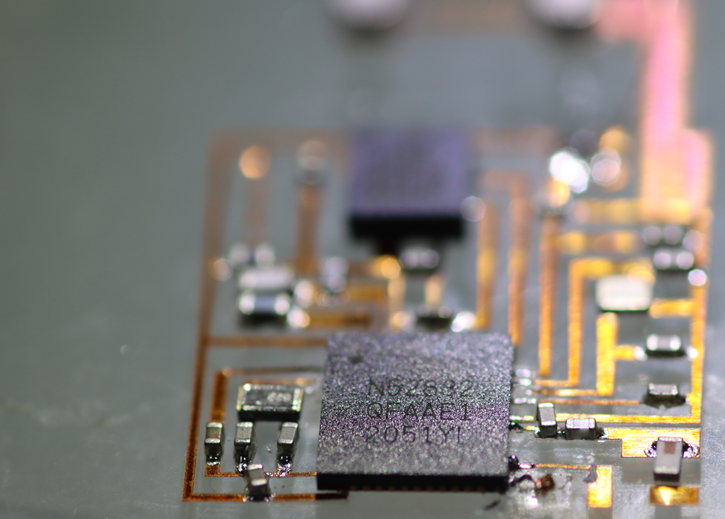

# **BSPWon_nRF52**

#####*(BLE chip integrated into circuit along with power source and an accelerometer)*  
Photo taken by Hee Kyu Lee, Won Research Group 

## *Project Overview*
--------------------------------------------
> #### The objective of this project is to enable wireless communication among peripheral devices to receive and transmit data and commands. The NRF board provides a developer  environment where the user can manually configure low level application procedures, giving the creator freedom to manage the incoming and outgoing data. With this functional flexibility, the microprocessor can be programmed to transmit data at configured rates and also provide interrupts to execute commands at certain instances. Some key functions that will be implemented include:
>  * Wirelessly transmit custom-made sensor data
>  * Receive transmitted data from peripheral (The device is supposed to work as both central & peripheral and uses proprietary BLE service)
>  * Execute commands based on received data
----------------------------------------------

## *Data Transmission*
------------------------------------------
> #### The BLE microprocessor will be integrated into a bio-sensor circuit which will continuously return data based on its current environment. The processor will receive the sensor's data and wirelessly transmit them to a central device, where a UI will be implemented to display the receieved raw data. 
----------------------------------------

## *Recieve Data from Peripheral* 
--------------------------------------------
> #### Enabling bi-directional communication is paramount in effective communication. Along with transmitting data, the BLE chip must be able to receieve data sent by the peripheral device. The received data will automatically be parsed to a string data format. The received string data can trigger certain commands that are programmed into the chip.
--------------------------------------------

## *Command Execution* 
--------------------------------------------
> #### The BLE chip will be programmed to trigger certain actions based on the received string data of the peripheral device. Currently, the chip can execute three key commands:
> Single LED ON/OFF | Cascade Multiple LED's | Toggle Control Pins
> ----------------- | -----------------------|---------------------
> LEDON: String data "LEDON", from the peripheral device will have the chip trigger the registered LED pin as high to turn on the LED. | LEDCASCADE: String data "LEDCASCADE", > > from peripheral device will have the chip trigger multiple pins consecutively based on the timer frequency. | Control_Pin_On: Similar to the LED's, the configured control pins are set to the HIGH state to receive data from devices that may soon be added in the future. 
> LEDOFF: String data "LEDOFF", from the peripheral device will have the chip trigger the registered LED pin as low to turn off the LED. | LEDCASCADEOFF: String data "LEDCASCADEOFF", from peripheral device will have the chip set all of the registered pins to LOW. | Control_Pin_Off: The control pin is set back to its LOW state, disabling the device. 
--------------------------------------------

## * Pin Usage*
--------------------------------------------
> #### Already Used Pins (IN-BOARD)
P0.13 :: Button1  
P0.14 :: Button2  
P0.15 :: Button3  
P0.16 :: Button4  
P0.17 :: LED1  
P0.18 :: LED2  
P0.19 :: LED3  
P0.20 :: LED4  
P0.21 :: RESET Button 

> #### Analog Input Pins
P0.28 :: CH:W  
P0.29 :: CH:X  
P0.30 :: CH:Y  
P0.31 :: CH:Z in BSPWon iOS Application

> #### Cascade Action Pins 
P0.12 
P0.22  
P0.23  
P0.24  
P0.25  

> #### Control Pins
P0.03 :: Control Pin 1 
P0.04 :: Control Pin 2
